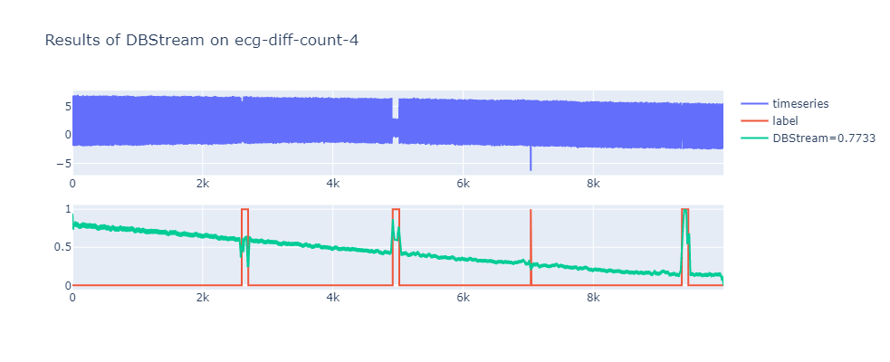
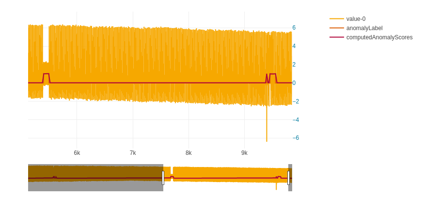
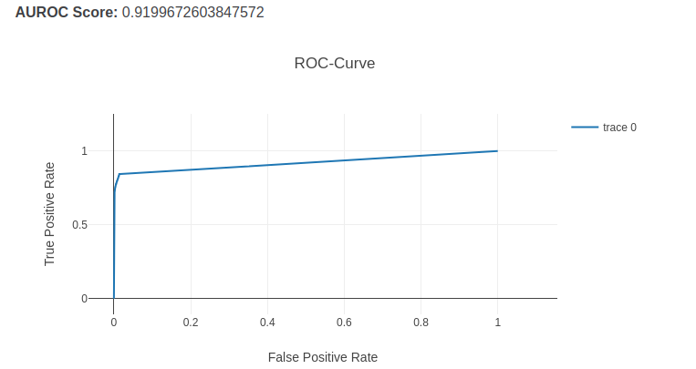
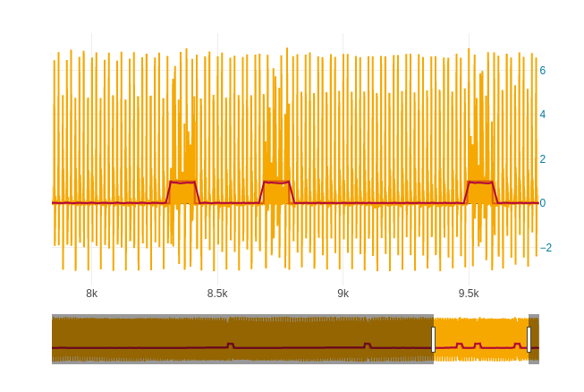
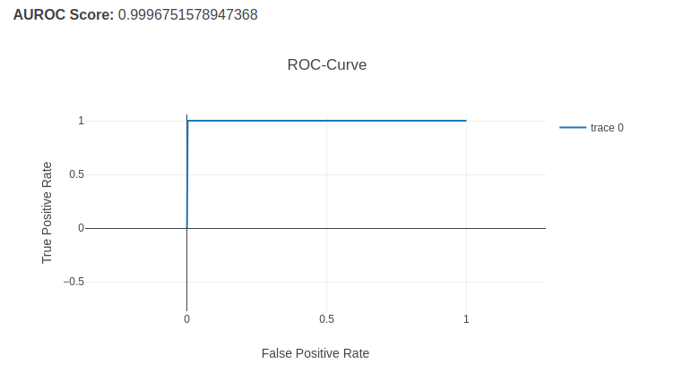

# DBSTREAM (and other clustering approaches)

|||
| :--- | :--- |
| Citekey | HahslerBolaos2016Clustering |
| Source Code | [https://github.com/mhahsler/stream](https://github.com/mhahsler/stream) |
| Learning type | unsupervised |
| Input Dimensionality | multivariate |
|||

## Dependencies

- System dependencies for installation of R-package (`apt`)
  - build-essential (make, gcc, ...)
  - r-base-dev
- r-base >= 3.6.0
- r-codetools
- R-packages
  - stream
  - BBMisc

## Notes

The authors of the algorithm DBStream haven't proposed a way to use DBStream for Anomaly Detection in their paper [Clustering Data Streams Based on Shared Density between Micro-Clusters](https://ieeexplore.ieee.org/document/7393836). Therefore we had to come up with our own way of using the DBStream Clustering Algorithm for Anomaly Detection.
Our approach consists of the following steps:

- Split the input time-series into subsequences. Each of this subsequences represents one point to be clustered.
- Using DBStream on the these subsequences with the Cm parameter set to 0. Therefore each subsequences gets clustered into a micro-cluster, even if that cluster only consits of a single point.
Then these micro-clusters are reclustered to macro-clusters, however there can be noisey micro-cluster which are not assigned to a macro-cluster.
- Retrieve the cluster assignments as well as the macro-cluster centers and compute the anomaly score for each point the following way:
  - If the point is in a micro-cluster, which is assigned to a macro-cluster, then the negated weight of this macro cluter will be the anomaly score of the point.
  - If the point is in a micro-cluster, which is not assigned to a macro-cluster, then its anomaly score will be set to the maximum negated weight from all macro clusters
- Convert those anomaly scores for sequences into anomaly scores for points by computing the average anomaly score for each point over all sequences it is included.

**Note**
It appears, that the algorithm reacts very sensitive to the value used for the parameter radius. The default value is 0.1, but it for some datasets it can even be necessary to increase the value to 0.5.

## Performance
Previously, DBSTREAM was performing on many datasets very poorly. This can be seen for example in the ecg-diff-4 dataset here:

After tweaking DBSTREAM the performance on this dataset has significantly improved, which can be seen here:

DBSTREAM is now also performing better on the sinus frequency dataset:

