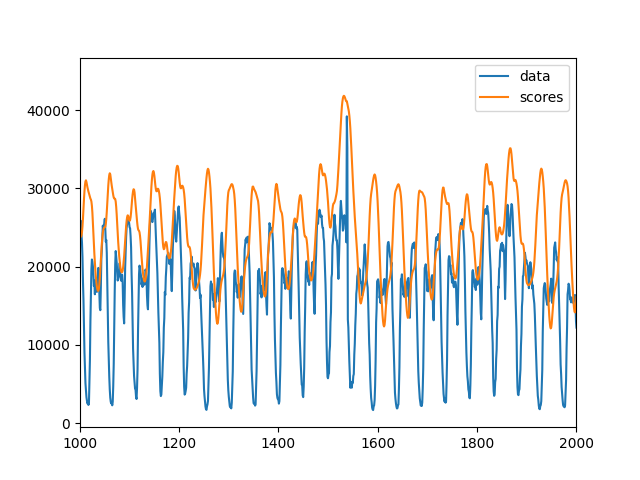
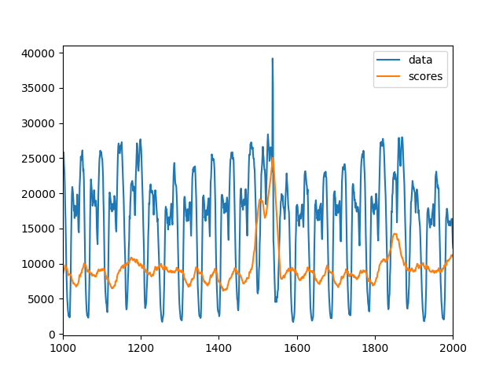
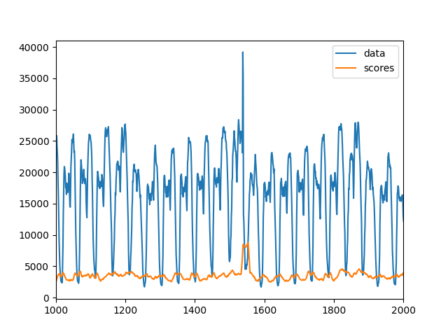
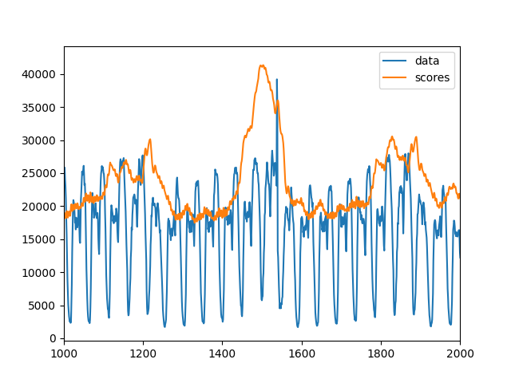
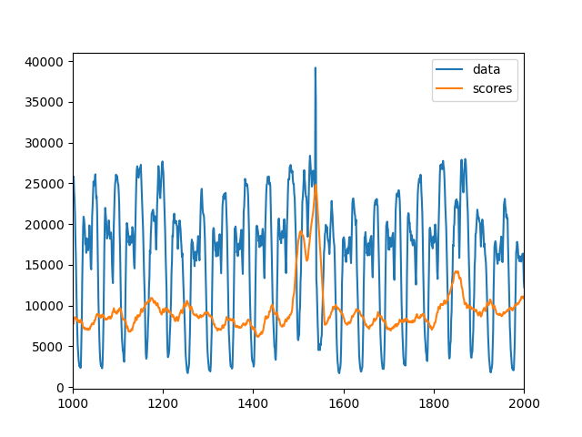
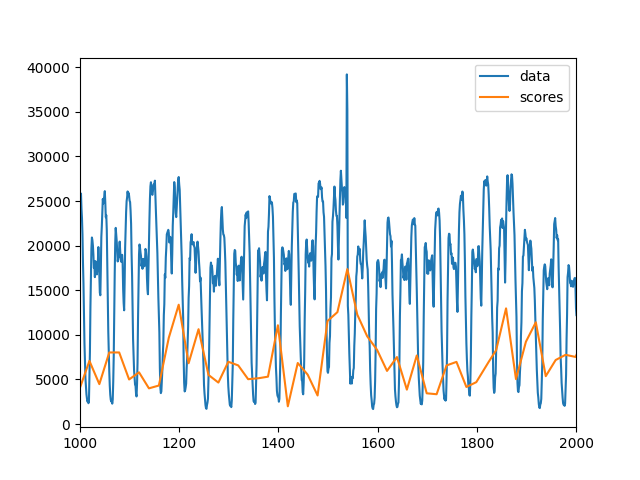

# K-Means

|||
| :--- | :--- |
| Citekey | YairiEtAl2001Fault |
| Source | `own` |
| Learning type | unsupervised |
| Input dimensionality | multivariate |
|||

## Dependencies

- python 3

## Hyper Parameters

### k (n_clusters)

`k` is the number of clusters to be fitted to the data. The bigger `k` is, the less noisy the anomaly scores are.

Small `k` (k==2)


Big `k` (k==20)


### window_size

This parameter defines the number of data points being chunked in one window. The bigger `window_size` is, the bigger the anomaly context is. If it's to big, things seem anomalous that are not. If it's too small, the algorithm is not able to find anomalous windows and looses its time context.
If `window_size` (`anomaly_window_size`) is smaller than the anomaly, the algorithm might only detect the transitions between normal data and anomaly.

Small `window_size` (window_size == 5)


Big `window_size` (window_size == 50)


### stride

It is the step size between windows. The larger `stride` is, the noisier the scores get.

Small `stride` (stride == 1)


Big `stride` (stride == 20)


(Plots were made after post-processing)

## Notes

KMeans outputs anomaly scores for windows.
The results require post-processing.
The scores for each point can be assigned by aggregating the anomaly scores for each window the point is included in.

U can use the following code snippet for the post-processing step in TimeEval (default parameters directly filled in from the source code):

<!--BEGIN:timeeval-post-->
```python
from timeeval.utils.window import ReverseWindowing
# post-processing for k-means
def post_kmeans(scores: np.ndarray, args: dict) -> np.ndarray:
    window_size = args.get("hyper_params", {}).get("anomaly_window_size", 20)
    return ReverseWindowing(window_size=window_size).fit_transform(scores)
```
<!--END:timeeval-post-->
