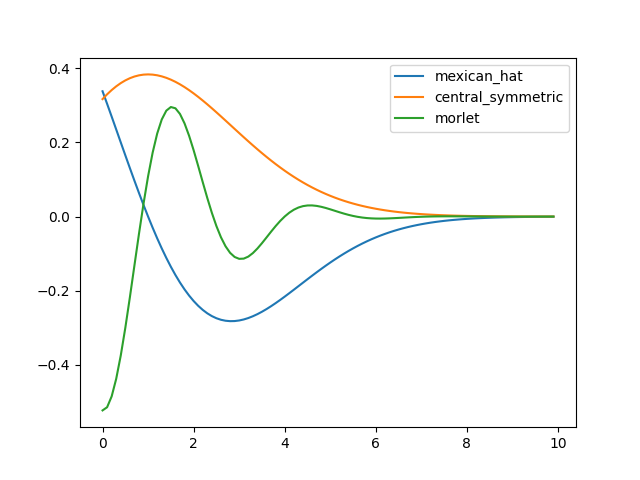
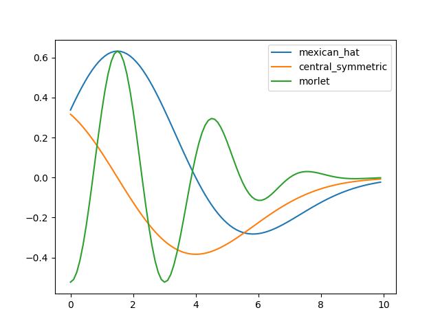

# OceanWNN

|||
| :--- | :--- |
| Citekey | WangEtAl2019Study |
| Source code | `own` |
| Learning type | semi-supervised |
| Input dimensionality | univariate |
|||

## Dependencies

- python 3
- pytorch

## Activation Functions

The model uses wavelet basis functions (WBF) as activation functions for the hidden layer. The following plot shows the 3 different options:

### Lower Bound (a=-2.5, k=-1.5)

### Upper Bound (a=2.5, k=1.5)

## Detection Strategies

The model keeps an internal threshold, which is the upper percentile of the normal distribution of its training errors.
When the model detects a point whose error exceeds this threshold, the next sliding window changes the outlier point with the predicted point.

## Anomaly Scores

OceanWNN forecasts points based on a preceding window. Hence, the first `window_size` points do not have a score.

## Future Ideas

Using LSTMs instead of Linear layers to allow multivariate data.
