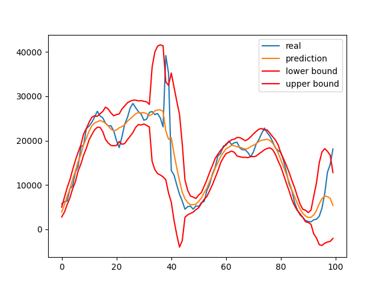
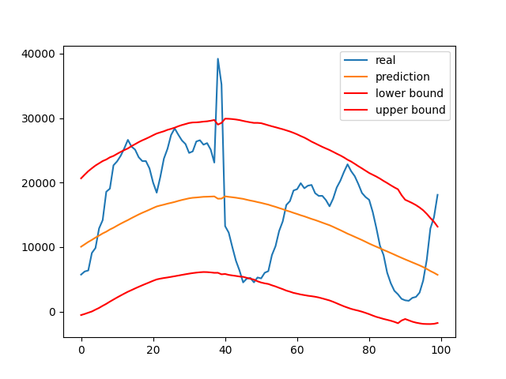
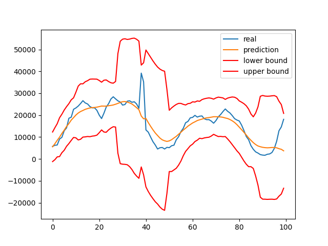
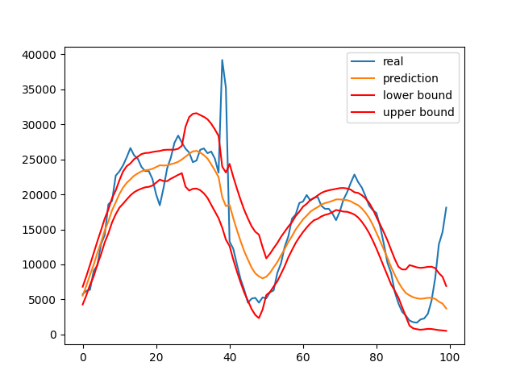

# PCI

|||
| :--- | :--- |
| Citekey | YuEtAl2014Time |
| Source | `own` |
| Learning type | unsupervised |
| Input dimensionality | univariate |
|||

## Dependencies

- python 3

## Hyper Parameters

### window_size

The algorithm uses windows around the current points to predict that point.
The difference between real and predicted value is used as anomaly score (`k = window_size // 2`).
The parameter `k` is the window size and therefore acts as a kind of smoothing factor.
The bigger the `k`, the smoother the predictions, the more values have big errors.
If `k` is too small, anomalies might not be found.

`window_size` should correlate with anomaly window sizes.

Small `k`

Big `k`

### thresholding_p

This parameter is only needed if the algorithm should decide itself whether a point is an anomaly.
It treats `p` as a confidence coefficient. It's the t-statistics confidence coefficient.
The smaller `p` is, the bigger is the confidence interval.
If `p` is too small, anomalies might not be found. If `p` is too big, too many points might be labeled anomalous.
Be aware that for example `p = 0.05` == `p = 0.95`, as we are talking about percentiles of the t-statistics.

Small `p`

Big `p`

