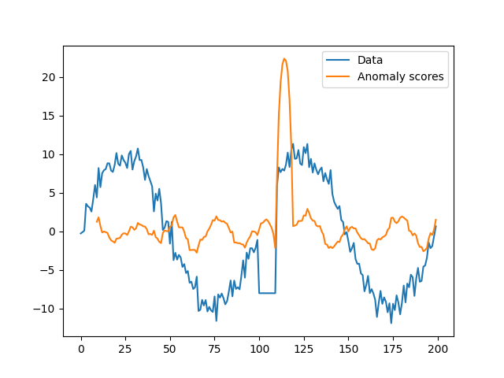
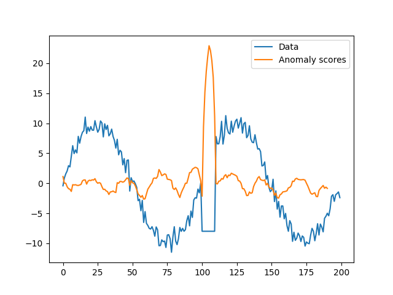

# PhaseSpace-SVM

|||
| :--- | :--- |
| Citekey | MaPerkins2003Timeseries |
| Source Code | `own` |
| Learning type | unsupervised |
| Input dimensionality | univariate |
|||

## Notes

- We use left-aligned windows to embed the time series into a phase space, because it produces better results.

  Right-aligned embedding:
  

  Left-aligned embedding:
  

- We take the raw scores from the SVM as output instead of aggregated binary labels.
  The scores are aggregated using `sum()`.

## Requirements

- numpy
- sklearn
